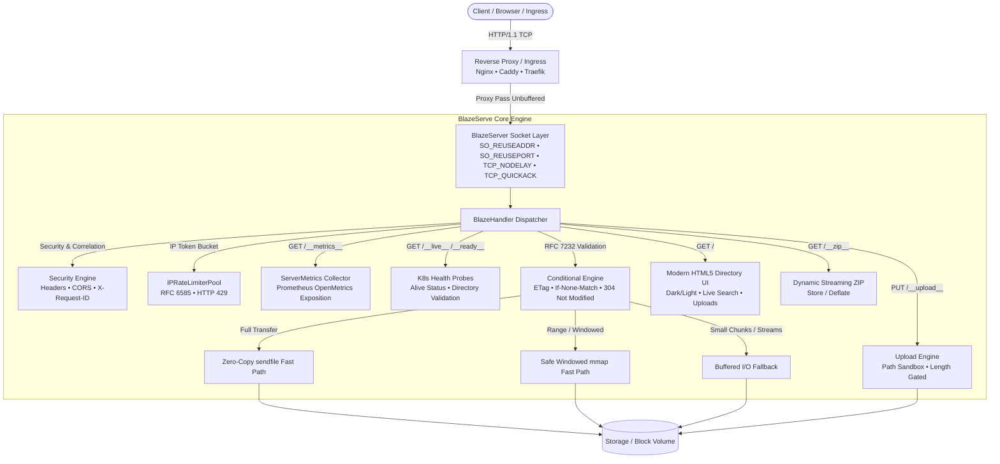

<div align="center">

# ⚡ BlazeServe

**High-Performance HTTP Edge Service & File Platform**

_Engineered with Zero-Copy Kernel I/O, Prometheus Telemetry, RFC 7232 Caching, and Enterprise Cloud Workflows_

[](https://pypi.org/project/blazeserve/)
[](https://pypi.org/project/blazeserve/)
[](https://github.com/whoisjayd/blazeserve/actions)
[](./LICENSE)
[](https://github.com/astral-sh/ruff)
[](https://mypy-lang.org/)
[](https://ghcr.io/whoisjayd/blazeserve)

<p align="center">
  <a href="#-why-blazeserve">Why BlazeServe</a> •
  <a href="#-architecture">Architecture</a> •
  <a href="#-engineering-disciplines">Role Highlights</a> •
  <a href="#-benchmarks">Benchmarks</a> •
  <a href="#-quick-start">Quick Start</a> •
  <a href="#-operational-endpoints">Endpoints</a> •
  <a href="#-deployment-workflows">Deployment</a> •
  <a href="#-cli-reference">CLI Reference</a>
</p>

</div>

## ⚡ Why BlazeServe?

Standard HTTP file servers (like `python -m http.server`) suffer from high CPU utilization, memory bloat on large transfers, missing conditional cache headers, and a complete absence of production observability.

**BlazeServe** re-engineers Python's HTTP transport into a production-grade edge service:

- **Zero-Copy Kernel I/O**: Direct kernel-to-socket transfers using `sendfile(2)` bypasses user-space buffers for multi-gigabyte files.
- **Deterministic Memory-Mapped Streaming**: High-throughput windowed `mmap` with strict `memoryview` pointer lifecycle management guarantees memory safety and eliminates Windows file-locking bugs.
- **SRE-Native Observability**: Native Prometheus OpenMetrics exposition (`/__metrics__`, `/metrics`) exposing Golden Signals (throughput, latency, active connections, error counters) alongside Kubernetes liveness (`/__live__`) and readiness (`/__ready__`) health probes.
- **RFC 7232 / 9110 HTTP Caching**: Full conditional validation (`ETag`, `Last-Modified`, `If-None-Match`, `If-Modified-Since`) returning `304 Not Modified` with zero network overhead.
- **Traffic Shaping & Rate Limiting**: Thread-safe per-client-IP token bucket rate limiting with RFC 6585 standard headers (`X-RateLimit-Limit`, `X-RateLimit-Remaining`) and HTTP `429 Too Many Requests` backoff.
- **Defense-in-Depth Security**: Automatic injection of `X-Content-Type-Options: nosniff`, `X-Frame-Options: DENY`, `Strict-Transport-Security`, `Permissions-Policy`, and path traversal verification.
- **Modern Responsive Web UI**: Glassmorphic HTML5 directory explorer with dark/light themes, instant client-side file filtering, SVG file type icons, and drag-and-drop uploads.

## 🏛️ Architecture

BlazeServe decouples socket orchestration, connection lifecycle, traffic limiting, and observability into modular, focused subsystems:




## 🎯 Engineering Disciplines Demonstrated

### 1. Backend Engineering

- **Zero-Copy & Memory Safety**: Dual-path file transmission leveraging kernel `sendfile` and memoryview-managed `mmap` with strict pointer cleanup (`view.release()`) preventing file descriptor leaks across Windows and Linux.
- **HTTP Specification Compliance**: Strict compliance with RFC 7232 (Conditional Requests), RFC 7233 (Range Requests & Multipart Byte-Ranges), and RFC 6585 (Rate Limiting).
- **Prompt Lifecycle Management**: Press `Ctrl+C` in the foreground server terminal to stop BlazeServe. Shutdown closes the listener promptly, and request threads do not keep the process alive.
- **TLS by Explicit Restart**: TLS requires a certificate/key pair and uses TLS 1.2 or newer. Certificate rotation is performed by a controlled service restart.

### 2. Site Reliability Engineering (SRE)

- **Golden Signals Monitoring**: Native metrics covering Latency, Traffic (`requests_total`, RPS), Errors (`errors_total`), and Saturation (`requests_active`, buffer usage).
- **Prometheus Telemetry**: Zero-dependency OpenMetrics text format generator for Prometheus scraping (`deploy/monitoring/prometheus.yml`).
- **Production Grafana Dashboard**: Ready-to-import dashboard (`deploy/monitoring/grafana-dashboard.json`) visualizing real-time bandwidth egress, active connections, and error ratios.
- **Automated Alerts**: Prometheus alert rules (`deploy/monitoring/alerts.yml`) for instance downtime and error rate spikes.
- **System Health Diagnostics**: Built-in `blaze doctor` verifying file readability, socket bindability, zero-copy support, and kernel optimization flags.

### 3. Cloud & DevOps Engineering

- **Multi-Stage Containerization**: Hardened `Dockerfile` built on `python:3.13-slim` using a dedicated unprivileged user (`blazeserve:10001`), read-only root filesystem, dropped capabilities, and native container `HEALTHCHECK`.
- **Cloud Orchestration**: Hardened `docker-compose.yml` with CPU/memory resource quotas and security constraints.
- **Kubernetes Manifests**: Hardened `Deployment` and `Service` defaults. Optional Ingress and ServiceMonitor manifests are available for deployments that provide their required controllers.
- **Systemd Architecture**: Sandboxed systemd service (`ProtectSystem=strict`, `ProtectHome=true`, `PrivateTmp=true`, `LimitNOFILE=1048576`); BlazeServe binds its own listening socket.
- **Reverse Proxy Blueprints**: Battle-tested, streaming-tuned configurations for Nginx, Caddy, and Traefik v3.
- **Linux Kernel OS Tuning**: Idempotent performance tuning script (`deploy/linux-tuning/tuning.sh`) managing socket queue lengths (`somaxconn=65535`), TCP window memory (`16MB`), and file descriptor limits (`1M`).


## 📊 Benchmarking

Run a self-contained benchmark:

```console
blaze benchmark
```

By default, BlazeServe starts a temporary server on an OS-assigned free port, binds it only to loopback, benchmarks the synthetic `/__speed__` endpoint, and tears the server down automatically. This mode does not serve your files or expose them outside the local machine.

To benchmark an existing local or remote BlazeServe process, pass its origin explicitly:

```console
blaze benchmark --url http://127.0.0.1:8000 --size-mb 100
```

Explicit `--url` mode never starts a replacement server. A connection-refused error means the target server or port is unavailable; confirm that the server is running and that its port matches `--url`.

Throughput, latency, and memory usage depend on the host kernel, storage, network, TLS, and reverse-proxy configuration. Publish benchmark figures only with the command, workload, machine specifications, and comparison methodology used to obtain them.


## 🚀 Quick Start

### 1. Installation via PyPI

Install uv using the [official instructions](https://docs.astral.sh/uv/getting-started/installation/), then install BlazeServe as a standalone command-line tool:

```bash
uv tool install blazeserve
```


### 2. Run Instantly

```console
# Serve the current directory on port 8000
blaze serve .

# Serve a relative data directory with rate limiting, CORS, and JSON logs
blaze serve data --port 8080 --rate-mbps 100 --cors --log-json

# Validate the current directory and port
blaze doctor . --port 8000
```

### 3. Run with Docker

POSIX shell:

```bash
docker run -d \
  --name blazeserve \
  -p 8000:8000 \
  -v "$(pwd)/data:/data:ro" \
  --read-only \
  ghcr.io/whoisjayd/blazeserve:latest
```

Windows PowerShell:

```powershell
docker run -d `
  --name blazeserve `
  -p 8000:8000 `
  -v "${PWD}\data:/data:ro" `
  --read-only `
  ghcr.io/whoisjayd/blazeserve:latest
```


## 📡 Operational & Telemetry Endpoints

BlazeServe provides dedicated operational endpoints that do not conflict with served filesystem assets:

| Endpoint        |    Method     |      Response Format       | Purpose                                                                                                                                   |
| :-------------- | :-----------: | :------------------------: | :---------------------------------------------------------------------------------------------------------------------------------------- |
| `/__live__`     | `GET`, `HEAD` |     `application/json`     | **Kubernetes Liveness Probe**: Returns `200 {"status":"alive"}` when process is healthy.                                                  |
| `/__ready__`    | `GET`, `HEAD` |     `application/json`     | **Kubernetes Readiness Probe**: Returns `200 {"status":"ready"}` if root directory is readable; returns `503` if storage is disconnected. |
| `/__metrics__`  | `GET`, `HEAD` |        `text/plain`        | **Prometheus Telemetry**: OpenMetrics text exposition format (`# HELP`, `# TYPE`, counters, gauges).                                      |
| `/__health__`   | `GET`, `HEAD` |     `application/json`     | **Application Health**: Returns server version and continuous uptime seconds.                                                             |
| `/__version__`  | `GET`, `HEAD` |     `application/json`     | **Runtime Info**: Machine-readable JSON output of version, python runtime, and OS platform.                                               |
| `/__perf__`     | `GET`, `HEAD` |     `application/json`     | **Performance Metrics**: In-depth statistics including total requests, active requests, bytes sent/received, and TCP buffer config.       |
| `/__stats__`    | `GET`, `HEAD` |     `application/json`     | **Legacy Stats**: Lightweight counter tracking total bytes transmitted.                                                                   |
| `/__speed__`    | `GET`, `HEAD` | `application/octet-stream` | **Synthetic Throughput Test**: Generates zeroed bytes (`?bytes=100000000`) for network throughput benchmarking without disk I/O.          |
| `/__zip__`      | `GET`, `HEAD` |     `application/zip`      | **Dynamic Directory Archiver**: Streams on-the-fly ZIP archives of entire directories (`?path=subfolder`).                                |
| `/__upload__/*` | `PUT`, `POST` |     `application/json`     | **Secure File Upload**: Chunked upload destination with path traversal protection and max file size gating.                               |


## 💻 CLI Reference

BlazeServe features an intuitive, colorized CLI powered by `click` and `rich`:

```
Usage: blaze [OPTIONS] COMMAND [ARGS]...

Commands:
  serve      Serve a directory or a single file.
  send       Quick share a single file with one command.
  doctor     Validate system environment and server configuration.
  benchmark  Run a high-speed throughput benchmark.
  checksum   Compute SHA256 checksums for files.
  version    Show version and system info (--json for machine-readable).
```

### Command Highlights

```console
# Serve a relative directory with bandwidth throttle and CORS
blaze serve files --port 8080 --rate-mbps 250 --cors --log-json

# Share one file with TLS
blaze send archive.tar.gz --port 8443 --tls-cert cert.pem --tls-key key.pem

# Check a relative directory and port
blaze doctor data --port 8080

# Run a self-contained benchmark with a temporary loopback-only server
blaze benchmark

# Benchmark the existing server at this URL
blaze benchmark --url http://127.0.0.1:8000 --size-mb 200

# Print machine-readable version data
blaze version --json
```


## 📦 Production Deployment Workflows

Detailed deployment guides and verified configuration templates are provided in the [`deploy/`](./deploy) directory:

- **[Docker & Compose](./deploy/README.md)**: Hardened multi-stage build, unprivileged user (`uid 10001`), and Docker Compose resource limits.
- **[Kubernetes Manifests](./deploy/k8s/)**: Hardened `Deployment` and `Service` defaults, plus optional Ingress and ServiceMonitor templates.
- **[Systemd Service](./deploy/systemd/)**: Hardened Linux service unit with kernel sandboxing (`ProtectSystem=strict`); it does not use socket activation.
- **[Reverse Proxies](./deploy/reverse-proxy/)**: Unbuffered streaming configurations for **Nginx**, **Caddy**, and **Traefik v3**.
- **[Linux Kernel Tuning](./deploy/linux-tuning/)**: Production `sysctl-blazeserve.conf` settings and automated `tuning.sh` script.
- **[SRE Monitoring](./deploy/monitoring/)**: Prometheus scrape specs, Prometheus alert rules, and complete Grafana dashboard JSON.

See **[DEPLOYMENT.md](./DEPLOYMENT.md)** for complete operational procedures.


## 🛠️ Development & Testing

The development workflow uses uv to create and manage the project environment. Install uv using the [official instructions](https://docs.astral.sh/uv/getting-started/installation/), then:

```console
# Clone repository
git clone https://github.com/whoisjayd/blazeserve.git
cd blazeserve

# Install the project and development dependencies in uv's environment
uv sync --locked --all-extras --dev

# Run Ruff linter and formatter checks
uv run ruff check .
uv run ruff format --check .

# Run strict Mypy type validation
uv run mypy blazeserve

# Run the test suite concurrently with coverage
uv run pytest -n auto -q --cov=blazeserve --cov-report=xml --cov-report=term-missing
```


## 📄 License & Contributing

- **License**: MIT License - see [LICENSE](./LICENSE) for details.
- **Contributing**: Contributions are welcome! See [CONTRIBUTING.md](./CONTRIBUTING.md) for conventions.
- **Security**: For security vulnerability disclosure, see [SECURITY.md](./SECURITY.md).
